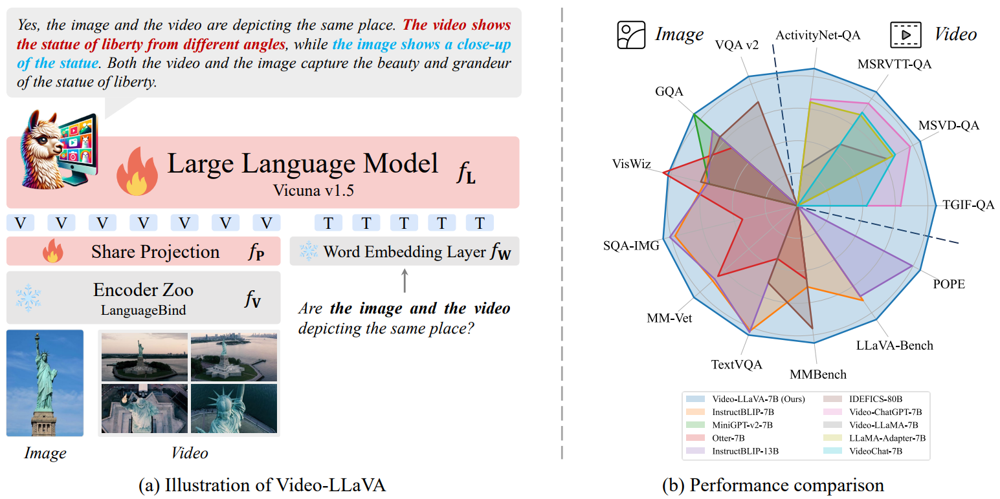
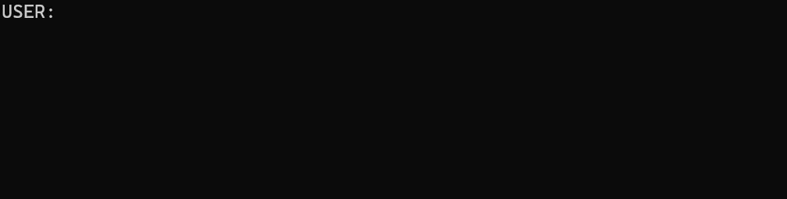
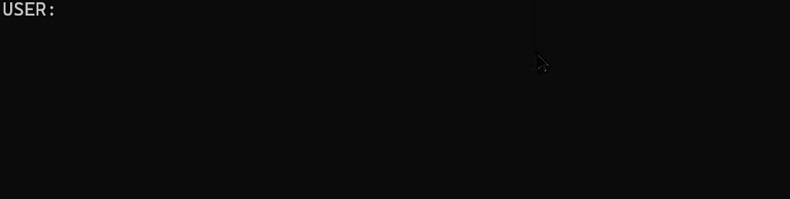
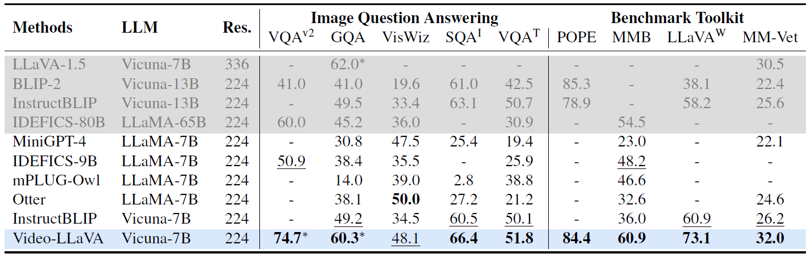
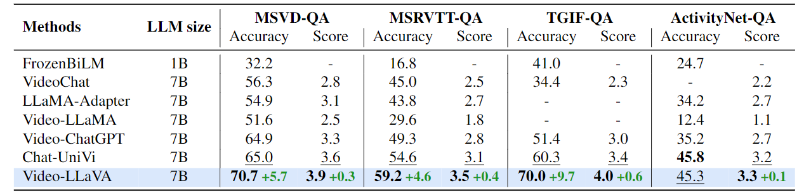

<p align="center">
    
<p>
<h2 align="center"> <a href="https://arxiv.org/abs/2311.10122">Video-LLaVA: Learning United Visual Representation by Alignment Before Projection</a></h2>
<h5 align="center"> If you like our project, please give us a star ⭐ on GitHub for latest update.  </h2>


<h5 align="center">
    
[](https://huggingface.co/spaces/LanguageBind/Video-LLaVA)
[](https://openxlab.org.cn/apps/detail/jiaxicui/Video-LLaVA)
[](https://modelscope.cn/studios/PKU-YuanLab/Video-LLaVA)
[](https://replicate.com/nateraw/video-llava)
[](https://arxiv.org/abs/2311.10122) <br>
[](https://github.com/PKU-YuanGroup/Video-LLaVA/blob/main/LICENSE) 
[](https://hits.seeyoufarm.com)
[](https://github.com/PKU-YuanGroup/Video-LLaVA/issues?q=is%3Aopen+is%3Aissue)
[](https://github.com/PKU-YuanGroup/Video-LLaVA/issues?q=is%3Aissue+is%3Aclosed)  <br>
[](https://twitter.com/_nateraw/status/1726783481248977037)
[](https://twitter.com/arankomatsuzaki/status/1726421417963516144)
[](https://twitter.com/jesselaunz/status/1726850138776453379)
[](https://mp.weixin.qq.com/s/EFqLv_Euf5VU024zOtzkkg)
[](https://mp.weixin.qq.com/s/uwaxMu8UbJpcLTXsNJwpVQ)
[](https://zhuanlan.zhihu.com/p/668166885)
[](https://www.youtube.com/watch?v=EFkN00rGq1U&ab_channel=JesseLau-aTrader)
<!--[](https://zhuanlan.zhihu.com/p/668166885)-->

</h5>

[](https://paperswithcode.com/sota/zeroshot-video-question-answer-on-msrvtt-qa?p=video-llava-learning-united-visual-1) <br>
[](https://paperswithcode.com/sota/zeroshot-video-question-answer-on-msvd-qa?p=video-llava-learning-united-visual-1) <br>
[](https://paperswithcode.com/sota/zeroshot-video-question-answer-on-tgif-qa?p=video-llava-learning-united-visual-1) <br>

<details open><summary>💡 I also have other video-language projects that may interest you ✨. </summary><p>
<!--  may -->

> [**LanguageBind: Extending Video-Language Pretraining to N-modality by Language-based Semantic Alignment**](https://arxiv.org/abs/2310.01852) <br>
> Bin Zhu, Bin Lin, Munan Ning, Yang Yan, Jiaxi Cui, HongFa Wang, Yatian Pang, Wenhao Jiang, Junwu Zhang, Zongwei Li, Wancai Zhang, Zhifeng Li, Wei Liu, Li Yuan <br>
[](https://github.com/PKU-YuanGroup/LanguageBind) [](https://arxiv.org/abs/2310.01852) <br>

> [**Video-Bench: A Comprehensive Benchmark and Toolkit for Evaluating Video-based Large Language Models**](https://arxiv.org/abs/2311.08046) <br>
> Munan Ning, Bin Zhu, Yujia Xie, Bin Lin, Jiaxi Cui, Lu Yuan, Dongdong Chen, Li Yuan <br>
[](https://github.com/PKU-YuanGroup/Video-Bench) [](https://arxiv.org/abs/2311.16103) <br>

> [**Chat-UniVi: Unified Visual Representation Empowers Large Language Models with Image and Video Understanding**](https://arxiv.org/abs/2311.08046) <br>
> Peng Jin, Ryuichi Takanobu, Caiwan Zhang, Xiaochun Cao, Li Yuan <br>
[](https://github.com/PKU-YuanGroup/Chat-UniVi) [](https://arxiv.org/abs/2311.08046) <br>
</p></details>


## 📰 News
* **[2023.11.30]**  🤝Thanks to the generous contributions of the community, the [OpenXLab's demo](https://openxlab.org.cn/apps/detail/houshaowei/Video-LLaVA) is now accessible.
* **[2023.11.23]**  We are training a new and powerful model that supports more frames ! 
* **[2023.11.21]**  🤝Check out the [replicate demo](https://replicate.com/nateraw/video-llava), created by [@nateraw](https://github.com/nateraw), who has generously supported our research!
* **[2023.11.20]**  🤗[Hugging Face demo](https://huggingface.co/spaces/LanguageBind/Video-LLaVA) and **all codes & datasets** are available now! Welcome to **watch** 👀 this repository for the latest updates.

## 😮 Highlights

Video-LLaVA exhibits remarkable interactive capabilities between images and videos, despite the absence of image-video pairs in the dataset.

### 💡 Simple baseline, learning united visual representation by alignment before projection
- With **the binding of unified visual representations to the language feature space**, we enable an LLM to perform visual reasoning capabilities on both images and videos simultaneously.

### 🔥 High performance, complementary learning with video and image
- Extensive experiments demonstrate **the complementarity of modalities**, showcasing significant superiority when compared to models specifically designed for either images or videos. 



## 🤗 Demo

* **Gradio Web UI**

Highly recommend trying out our web demo by the following command, which incorporates all features currently supported by Video-LLaVA. We also provide [online demo](https://huggingface.co/spaces/LanguageBind/Video-LLaVA) in Huggingface Spaces.
```bash
python -m  llava.serve.gradio_web_server
```


https://github.com/PKU-YuanGroup/Video-LLaVA/assets/62638829/71ab15ac-105e-4b18-b0b5-e1b35d70607b


* **CLI Inference**

```bash
python -m llava.serve.cli --model-path "LanguageBind/Video-LLaVA-7B" --video-file "path/to/your/video.mp4" --load-4bit
```



```bash
python -m llava.serve.cli --model-path "LanguageBind/Video-LLaVA-7B" --image-file "path/to/your/image.jpg" --load-4bit
```



## 🚀 Main Results

### Image understanding
<p align="left">

</p>

### Video understanding
<p align="left">

</p>

## 🛠️ Requirements and Installation
* Python >= 3.10
* Pytorch == 2.0.1
* CUDA Version >= 11.7
* Install required packages:
```bash
git clone https://github.com/PKU-YuanGroup/Video-LLaVA
cd Video-LLaVA
conda create -n videollava python=3.10 -y
conda activate videollava
pip install --upgrade pip  # enable PEP 660 support
pip install -e .
pip install -e ".[train]"
pip install flash-attn --no-build-isolation
pip install decord opencv-python git+https://github.com/facebookresearch/pytorchvideo.git@28fe037d212663c6a24f373b94cc5d478c8c1a1d
```

## 🤖 API
**We open source all codes.** If you want to load the model (e.g. ```LanguageBind/Video-LLaVA-7B```) on local, you can use the following code snippets.

### Inference for image
```python
import torch
from llava.constants import X_TOKEN_INDEX, DEFAULT_X_TOKEN
from llava.conversation import conv_templates, SeparatorStyle
from llava.model.builder import load_pretrained_model
from llava.utils import disable_torch_init
from llava.mm_utils import tokenizer_X_token, get_model_name_from_path, KeywordsStoppingCriteria

def main():
    disable_torch_init()
    image = 'llava/serve/examples/extreme_ironing.jpg'
    inp = 'What is unusual about this image?'
    model_path = 'LanguageBind/Video-LLaVA-7B'
    device = 'cuda'
    load_4bit, load_8bit = True, False
    model_name = get_model_name_from_path(model_path)
    tokenizer, model, processor, context_len = load_pretrained_model(model_path, None, model_name, load_8bit, load_4bit, device=device)
    image_processor = processor['image']
    conv_mode = "llava_v1"
    conv = conv_templates[conv_mode].copy()
    roles = conv.roles

    image_tensor = image_processor.preprocess(image, return_tensors='pt')['pixel_values']
    if type(image_tensor) is list:
        tensor = [image.to(model.device, dtype=torch.float16) for image in image_tensor]
    else:
        tensor = image_tensor.to(model.device, dtype=torch.float16)
    key = ['image']

    print(f"{roles[1]}: {inp}")
    inp = DEFAULT_X_TOKEN['IMAGE'] + '\n' + inp
    conv.append_message(conv.roles[0], inp)
    conv.append_message(conv.roles[1], None)
    prompt = conv.get_prompt()
    input_ids = tokenizer_X_token(prompt, tokenizer, X_TOKEN_INDEX['IMAGE'], return_tensors='pt').unsqueeze(0).cuda()
    stop_str = conv.sep if conv.sep_style != SeparatorStyle.TWO else conv.sep2
    keywords = [stop_str]
    stopping_criteria = KeywordsStoppingCriteria(keywords, tokenizer, input_ids)

    with torch.inference_mode():
        output_ids = model.generate(
            input_ids,
            images=[tensor, key],
            do_sample=True,
            temperature=0.2,
            max_new_tokens=1024,
            use_cache=True,
            stopping_criteria=[stopping_criteria])

    outputs = tokenizer.decode(output_ids[0, input_ids.shape[1]:]).strip()
    print(outputs)

if __name__ == '__main__':
    main()
```

### Inference for video
```python
import torch
from llava.constants import X_TOKEN_INDEX, DEFAULT_X_TOKEN
from llava.conversation import conv_templates, SeparatorStyle
from llava.model.builder import load_pretrained_model
from llava.utils import disable_torch_init
from llava.mm_utils import tokenizer_X_token, get_model_name_from_path, KeywordsStoppingCriteria

def main():
    disable_torch_init()
    video = 'llava/serve/examples/sample_demo_1.mp4'
    inp = 'Why is this video funny?'
    model_path = 'LanguageBind/Video-LLaVA-7B'
    device = 'cuda'
    load_4bit, load_8bit = True, False
    model_name = get_model_name_from_path(model_path)
    tokenizer, model, processor, context_len = load_pretrained_model(model_path, None, model_name, load_8bit, load_4bit, device=device)
    video_processor = processor['video']
    conv_mode = "llava_v1"
    conv = conv_templates[conv_mode].copy()
    roles = conv.roles

    video_tensor = video_processor(video, return_tensors='pt')['pixel_values']
    if type(video_tensor) is list:
        tensor = [video.to(model.device, dtype=torch.float16) for video in video_tensor]
    else:
        tensor = video_tensor.to(model.device, dtype=torch.float16)
    key = ['video']

    print(f"{roles[1]}: {inp}")
    inp = DEFAULT_X_TOKEN['VIDEO'] + '\n' + inp
    conv.append_message(conv.roles[0], inp)
    conv.append_message(conv.roles[1], None)
    prompt = conv.get_prompt()
    input_ids = tokenizer_X_token(prompt, tokenizer, X_TOKEN_INDEX['VIDEO'], return_tensors='pt').unsqueeze(0).cuda()
    stop_str = conv.sep if conv.sep_style != SeparatorStyle.TWO else conv.sep2
    keywords = [stop_str]
    stopping_criteria = KeywordsStoppingCriteria(keywords, tokenizer, input_ids)

    with torch.inference_mode():
        output_ids = model.generate(
            input_ids,
            images=[tensor, key],
            do_sample=True,
            temperature=0.1,
            max_new_tokens=1024,
            use_cache=True,
            stopping_criteria=[stopping_criteria])

    outputs = tokenizer.decode(output_ids[0, input_ids.shape[1]:]).strip()
    print(outputs)

if __name__ == '__main__':
    main()
```

## 🗝️ Training & Validating
The training & validating instruction is in [TRAIN_AND_VALIDATE.md](TRAIN_AND_VALIDATE.md).

## 👍 Acknowledgement
* [LLaVA](https://github.com/haotian-liu/LLaVA) The codebase we built upon and it is an efficient large language and vision assistant.
* [Video-ChatGPT](https://github.com/mbzuai-oryx/Video-ChatGPT) Great job contributing the evaluation code and dataset.

## 🙌 Related Projects
* [LanguageBind](https://github.com/PKU-YuanGroup/LanguageBind) An open source five modalities language-based retrieval framework.
* [Chat-UniVi](https://github.com/PKU-YuanGroup/Chat-UniVi) This framework empowers the model to efficiently utilize a limited number of visual tokens.

## 🔒 License
* The majority of this project is released under the Apache 2.0 license as found in the [LICENSE](https://github.com/PKU-YuanGroup/Video-LLaVA/blob/main/LICENSE) file.
* The service is a research preview intended for non-commercial use only, subject to the model [License](https://github.com/facebookresearch/llama/blob/main/MODEL_CARD.md) of LLaMA, [Terms of Use](https://openai.com/policies/terms-of-use) of the data generated by OpenAI, and [Privacy Practices](https://chrome.google.com/webstore/detail/sharegpt-share-your-chatg/daiacboceoaocpibfodeljbdfacokfjb) of ShareGPT. Please contact us if you find any potential violation.

## ✏️ Citation
If you find our paper and code useful in your research, please consider giving a star :star: and citation :pencil:.

```BibTeX
@misc{lin2023videollava,
      title={Video-LLaVA: Learning United Visual Representation by Alignment Before Projection}, 
      author={Bin Lin and Yang Ye and Bin Zhu and Jiaxi Cui and Munan Ning and Peng Jin and Li Yuan},
      year={2023},
      eprint={2311.10122},
      archivePrefix={arXiv},
      primaryClass={cs.CV}
}
```

```BibTeX
@misc{zhu2023languagebind,
      title={LanguageBind: Extending Video-Language Pretraining to N-modality by Language-based Semantic Alignment}, 
      author={Bin Zhu and Bin Lin and Munan Ning and Yang Yan and Jiaxi Cui and HongFa Wang and Yatian Pang and Wenhao Jiang and Junwu Zhang and Zongwei Li and Wancai Zhang and Zhifeng Li and Wei Liu and Li Yuan},
      year={2023},
      eprint={2310.01852},
      archivePrefix={arXiv},
      primaryClass={cs.CV}
}
```

<!---->
## ✨ Star History
[](https://star-history.com/#PKU-YuanGroup/Video-LLaVA&Date)

## 🤝 Contributors

<a href="https://github.com/PKU-YuanGroup/Video-LLaVA/graphs/contributors">
  
</a>


